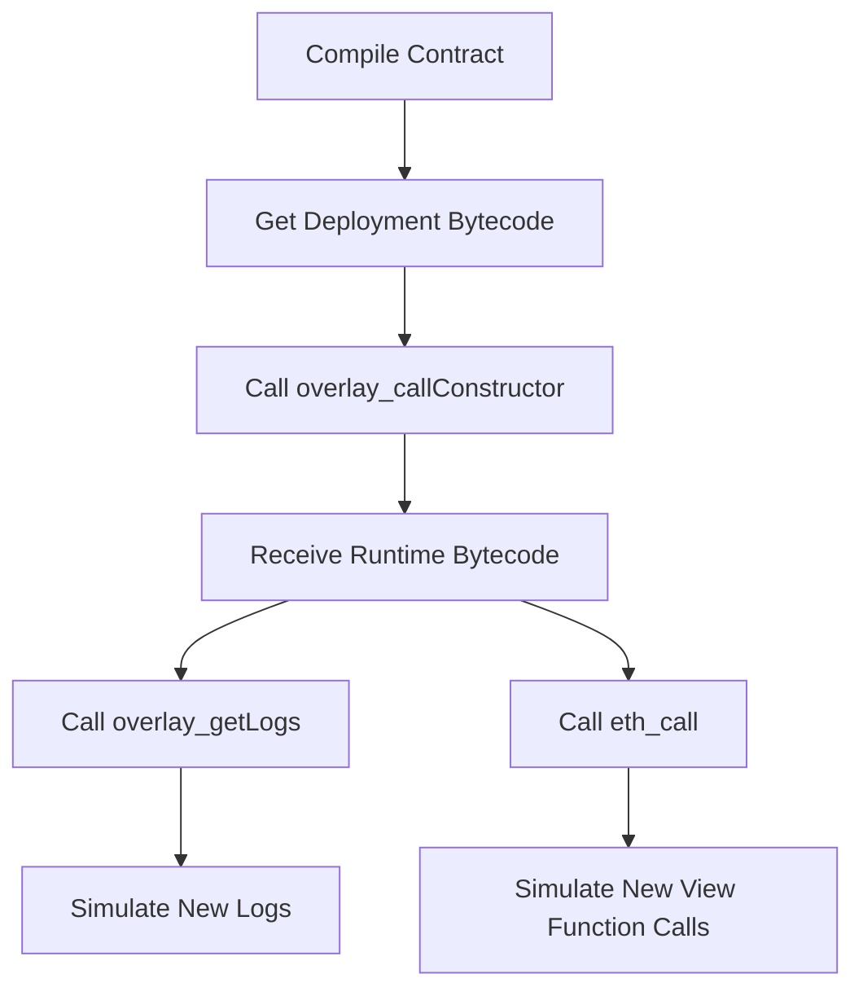
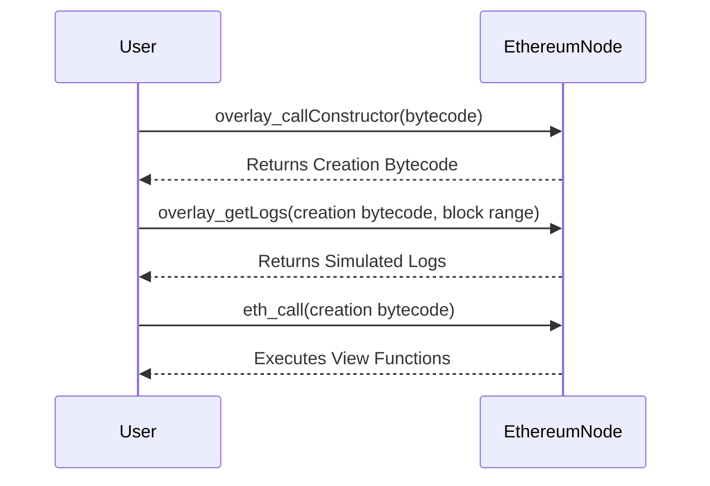

---

# Ad-hoc State Simulations of Contracts via Overlays

Erigon has introduced a powerful new feature called `overlays`, enabling ad-hoc state simulations of contracts. This allows users to replay the state with modified bytecode across any given block range, enhancing flexibility in contract testing and development.

## New RPC Methods

The `overlays` feature introduces two new RPC methods:

- `overlay_callConstructor`
- `overlay_getLogs`

These methods enable users to modify and interact with deployed contracts in ways that were previously difficult or impossible.





## Motivation

Overlays allow developers to inject custom logic into already deployed contracts, enabling simulations that can:

- Create new view functions
- Modify existing functions
- Change field visibility
- Emit new events
- Query historical data with modified source code

This open-source feature in Erigon democratizes the ability to experiment with contract modifications, making it easier for everyone to innovate and build new tools on top of existing contracts.

 <!-- Replace with an actual link to the diagram -->

## Usage

To utilize overlays, follow these steps:

1. **Compile your contract** to obtain the new deployment bytecode. Append any constructor arguments if necessary.
2. **Call `overlay_callConstructor`** with the result from step 1 to receive the runtime bytecode.
3. **Call `overlay_getLogs`** to simulate new logs, passing the bytecode from step 2 as state overrides.
4. **Call `eth_call`** to simulate new view function calls, again passing the bytecode from step 2 as state overrides.

Example:

```json
{
  "id": "1",
  "jsonrpc": "2.0",
  "method": "overlay_callConstructor",
  "params": ["<CONTRACT_ADDRESS>", "<BYTECODE>"]
}
```

## Ad-hoc Query Performance & Historical Back-filling

The `overlay_getLogs` method is optimized for ad-hoc range queries by skipping irrelevant blocks entirely during simulation. This optimization can lead to rapid results—sometimes in seconds—for simulating the entire historical logs of a contract. For contracts that interact with fewer blocks, this makes any infra for back-filling redundant.

However, for "busy" contracts that interact with a large portion of the blockchain history, you may still need to create custom back-filling scripts. For example, simulating the entire historical logs for the [Uniswap V2 router](https://etherscan.io/address/0x7a250d5630b4cf539739df2c5dacb4c659f2488d#code) took several hours on a host with 24 cores.

Performance metrics are not yet collected but could be added in the future to improve insights into contract-to-block distribution and optimization.

 <!-- Replace with an actual link to the diagram -->

## Configuration

1. Enable the `ots,overlay` API namespaces by adding them to the `--http.api` flag.
2. The implementation of `overlay_getLogs` is parallelized, so it's recommended to increase the `--db.read.concurrency` to a higher value (e.g., 256) to avoid blocking other Erigon goroutines.

 <!-- Replace with an actual link to the diagram -->

## API Details

### `overlay_callConstructor`

This method injects new bytecode into the contract's creation transaction. It returns the new creation bytecode result from the EVM to the caller.

Example request:

```json
{
  "id": "1",
  "jsonrpc": "2.0",
  "method": "overlay_callConstructor",
  "params": ["<CONTRACT_ADDRESS>", "<BYTECODE>"]
}
```

Example response:

```json
{
  "jsonrpc": "2.0",
  "id": "1",
  "result": {
    "code": "<CREATION_BYTECODE>"
  }
}
```

### `overlay_getLogs`

This method can be called multiple times to retrieve new logs from your modified bytecode. It operates similarly to `eth_getLogs` but accepts state overrides as a parameter.

Example request:

```json
{
  "id": 1,
  "jsonrpc": "2.0",
  "method": "overlay_getLogs",
  "params": [
    {
      "address": "<CONTRACT_ADDRESS>",
      "fromBlock": 19470165,
      "toBlock": 19478165
    },
    {
      "<CONTRACT_ADDRESS>": {
        "code": "<CREATION_BYTECODE>"
      }
    }
  ]
}
```

Example response:

```json
{
  "jsonrpc": "2.0",
  "id": 1,
  "result": [
    {
      "address": "<CONTRACT_ADDRESS>",
      "topics": [
        "0x8b615fdc5486fad0275d26c56169e31fd7a71d8f916bb2e9ba80b626903a8b64",
        "0x0000000000000000000000006f3a86a0fd7aafa0b679d4dac8ea7dfccce383ab"
      ],
      "data": "0x0000000000000000000000000000000000000000000001795e6d875dd7c7541500000000000000000000000000000000000000000000014611be39e4bd5d6c300000000000000000000000000000000000000000000000294b9e341f9bf78418",
      "blockNumber": "0x1293695",
      "transactionHash": "0xbdc424f1b17589e7b0ea169f65f2a8e30fee612acc0560db350f42ec26bd1f87",
      "transactionIndex": "0x7e",
      "blockHash": "0xf5b1c1783f3a0e0e5a26e862da7b77d07f6d7ba01da74182af0fc432cc62e404",
      "logIndex": "0x176",
      "removed": false
    }
  ]
}
```

### `eth_call`

This method can be used to call new view functions defined in your modified bytecode. By passing the creation bytecode received from `overlay_callConstructor` as state overrides, you can execute these new functions on the contract.

## Optimizations

Overlays employ a bitmap check with existing database indexes (`kv.CallFromIndex` and `kv.CallToIndex`) to identify blocks that can be safely skipped. This optimization significantly reduces processing time for contracts that do not interact with every block. However, for contracts that are highly active, the performance benefits may be less noticeable.

## Configuration Recap

- Add `ots,overlay` to your `--http.api` flag.
- Increase the concurrent database reads: `--db.read.concurrency=256`.

